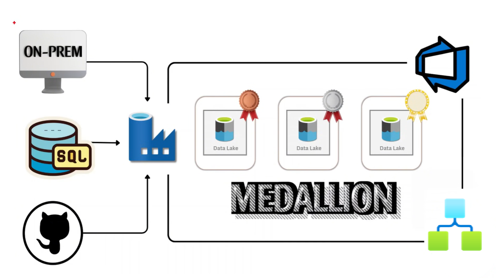
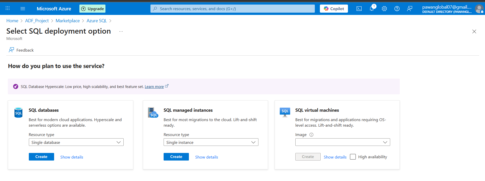

# Azure Data Factory – End-to-End Project with Azure DevOps

  

## Introduction

### What will we do?

* Migrate on-premises files to Azure Blob Storage.
* Ingest data using REST APIs.
* Migrate data from SQL Database to Azure Data Lake.
* Use modern architecture with Logic Apps to send failure alerts.
* Integrate a code repository with Git for DevOps, and GitHub workflows.
* Perform data transformation across multiple file formats such as Parquet, JSON, Delta, and CSV.
* Schedule pipelines for automated orchestration.
* Build a production-ready Medallion Architecture (Bronze, Silver, Gold).
* And more…

---

### Azure Data Factory (ADF)

Azure Data Factory is the backbone of most Azure data engineering roles. Even in Microsoft Fabric, Data Factory capabilities are integrated.
In this project, we will **master ADF** by implementing an end-to-end solution that covers all the ins and outs of pipeline development, orchestration, monitoring, and DevOps integration.

---

#### What will we learn?

* **Incremental Data Loading**:
  We will focus on incremental loading with respect to Data Lake Storage. Instead of traditional watermark tables (a now less common approach), we will adopt modern strategies aligned with **Delta Lake and lakehouse architectures**.

* **On-Premises to Cloud Migration**:
  Instead of using an on-prem SQL database, we will simulate real-world scenarios with on-prem **blob storage** — one of the most in-demand technologies for moving data to Azure, especially in AI-driven use cases where file-based data is critical.

* **Azure Logic Apps for Alerts**:
  Logic Apps will be integrated as the **alerting backbone**, ensuring robust monitoring and automated failure notifications.

---

### Architecture of the Project (Medallion Architecture)

We will implement the **Medallion Architecture (Bronze → Silver → Gold)**, a best practice for data lakes and lakehouses.

#### Data Sources Covered

* **On-Premises Data Sources**

  * On-prem SQL databases and on-prem file storage are both common.
  * While SQL databases remain important, the modern focus is on file-based ingestion (CSV, JSON, Parquet) since companies still store large amounts of financial and restricted data in shared drives. This data must be securely migrated for use in modeling, warehousing, and analytics.

* **SQL Databases**
  Whether hosted on-premises or in the cloud, SQL databases remain core enterprise sources. We will demonstrate migrating SQL data into **Azure Data Lake Storage**.

* **APIs & GitHub**
  We will also make **REST API calls** (e.g., GitHub APIs) to ingest external data sources into our pipeline.

---

#### Pipeline Design

* We will ingest data from multiple sources and create **dynamic pipelines** in ADF.
* These are not just static pipelines — they will support advanced scenarios like **incremental loading** without relying on watermark tables.
* Instead, we will implement strategies that align with **Delta Lake and modern data lakehouse designs**, since watermark tables do not scale well in these environments.

---

#### End-to-End Production Setup

By the end of this project, we will have:

* A **production-ready Medallion Architecture** implemented using Azure Data Factory.
* **Monitoring and alerting** integrated with Logic Apps.
* **DevOps integration** with Git, including:

  * Branching strategies.
  * Pull requests.
  * Deployment automation with ARM templates.

This ensures the project not only demonstrates technical concepts but also reflects **real-world, enterprise-grade practices**.

---

## Azure Portal

* To start this project, we first need an **Azure environment**.

  * Search for **“Azure free account”** in Google.
  * Click on the first link and select **Try Azure for Free**.
  * Sign in with your Microsoft account (or create a new one).
  * If you’re new, Azure may ask for credit card details and some personal information. Provide these to complete setup.
  * Once your account is ready, you will receive around **€200 in free credits** (if you’re in Europe).


* After creating the account, go to the **Azure Portal**.

  * Search for “Azure Portal” in Google and log in.


---

### Resource Groups

* In Azure, the first thing we work with is a **Resource Group**.

  * A resource group is like a **root folder** where you store all your resources (services and applications).
  * Within a resource group, you can create multiple **resources** (the Azure term for services).
  * Let’s start by creating a **Resource Group** to organize all services for this project.


---

### Creating Azure Data Factory

* Since we want to work with **Azure Data Factory (ADF)**, that will be our first resource.

  * From the Azure Marketplace, search for **Data Factory** and create it.


* Once created, go into the resource group, select the **ADF resource**, and launch **Azure Data Factory Studio**.


* We will **explore everything from scratch**. Although some steps can be automated, every solution has unique configurations. That’s why we will learn by **building everything manually first**.


---

### Exploring ADF Home

* The **ADF Studio** has several key sections:

1. **Author**

   * The development workspace where we build pipelines, datasets, and activities.

2. **Monitor**

   * Used for monitoring all executions:

     * Pipeline runs: status (success, failure, in-progress).
     * Trigger runs: automated pipeline executions.
     * Change Data Capture (CDC): ingest data as soon as it changes in the source.
     * Integration Runtime:

       * This is the **compute resource** for ADF that moves, transforms, and executes activities.
       * By default, Azure provides a **managed AutoResolveIntegrationRuntime**.
       * To migrate on-premises data to Azure, we need a **Self-hosted Integration Runtime**, installed on a local machine.

3. **Manage Tab**

   * Used to configure and manage ADF resources.


* Key options inside Manage:

  * **Linked Services**: Connections to data sources. Every source requires a linked service to read or write data.
  * **Integration Runtime**: Shows both Azure-managed and self-hosted runtimes, along with health monitoring.
  * **Microsoft Purview**: A data governance tool for lineage, schema tracking, and compliance (also part of Microsoft Fabric).
  * **ADF in Microsoft Fabric**: Allows **lift-and-shift migration** of pipelines into Fabric — the future of Azure analytics.
  * **Source Control**: Git integration and ARM template support for DevOps workflows.
  * **Triggers**: To schedule and run pipelines automatically.

---

## Integration Runtime (IR)

* Let’s revisit **Integration Runtime (IR)** in more detail.

* By default, one **Azure-managed IR** is already running for us. But sometimes we need more control.

* Imagine your data is sitting on your **friend’s local machine**. ADF doesn’t care *whose* machine it is — it only cares about one thing:

  * Whether the **IR application** on that machine is registered with the **runtime key** from your ADF account.
  * Once registered, ADF knows it can use that machine’s compute resources to move data.

* Now consider data stored as **files or blobs** on a local drive (instead of in a SQL database).

  * With the rise of **AI and machine learning**, industries like finance often deal with huge amounts of data in the form of **invoices, contracts, and unstructured files**.
  * These can’t always be stored in relational databases, so we need a way to migrate them securely into the cloud.
  * This is where **Self-hosted Integration Runtime (SHIR)** becomes important — it lets us connect to local files, drives, or private networks that aren’t accessible publicly.

* SHIR can:

  * Access files/blobs on a **local drive**.
  * Connect to **network drives** (e.g., corporate hosted drives).
  * Use the **resources of the local machine** (unlike Azure-managed IR, which is maintained by Microsoft).

---

### Creating a Self-hosted IR

1. Go to **Manage → Integration Runtime → New → Self-hosted**.
2. You will see two keys. Choose Option 2, which provides the **download link** for the IR application.
3. Install the application on your machine (or any machine that can access the data).
4. Open the IR app, paste the runtime key, and click **Register**.
5. After refreshing, you’ll see that your new IR is running.


* Now we can access:

  * On-prem data,
  * Files/blobs from local or hosted drives,
  * On-prem SQL servers that sit behind private networks.

In short: If data is **private** (on-prem servers, network drives, local files), we need **Self-hosted IR**. If data is **public or already in Azure**, the built-in IR is enough.

---

## Linked Services

* With IR in place, the next step is creating **Linked Services (LS)**.
* Linked Services are **connections** between ADF and a data source/destination.

### Creating Linked Service for On-Prem Files

1. In ADF, go to **Manage → Linked Services → New**.

2. Choose **File System** as the connector.
   

3. Fill details like:

   * **Name** of the service.
   * **Integration Runtime** → must select **Self-hosted IR** (since this is on-prem).

4. For **file path**:

   * In **corporate settings** → drives are usually hosted (e.g., `\\ServerName\SharedFolder\SubFolder`).
   * On a **local machine** → no need for `ServerName`, since SHIR is running on the same machine. Example: `C:\PawanFiles`.

5. **Authentication** → Username & Password.

   * Recommended: Use your **Microsoft account credentials** (not the local machine account).
   * To check if you’re logged in with a Microsoft account: Go to **Settings → Accounts → View Profile**.
   * If your profile shows an email (like `user@outlook.com`), it’s a Microsoft account.

6. **Common issue**:

   * Even with correct credentials, the connection might fail with error *“Unable to connect to C: drive”*.
   * This happens because SHIR **validates file paths by default**.
   * Solution: Disable validation using PowerShell (see [this StackOverflow article](https://stackoverflow.com/questions/76402958/azure-data-factory-linked-service-to-c-drive)).

---

### Creating Linked Service for Azure Data Lake

* Now we need a **destination** for our data → an **Azure Data Lake (ADLS Gen2)**.

1. In the Azure Portal, create a **Storage Account**.

   * Name it (unique name required).
   * Select **StorageV2 (general purpose)**.
   * Choose **Redundancy: LRS** (Local Redundant Storage → 3 replicas in the same data center).
   * Enable **Hierarchical Namespace** → this converts blob storage into a **Data Lake**.

     * Blob storage = flat structure.
     * Data Lake = hierarchical folders + advanced features.

2. Once created, go to the storage account → **Data Storage → Containers**.

   * Create a container named **bronze**.
   * This will hold raw ingested data. (No need for a separate raw folder, since raw data already sits on-prem, SQL, or GitHub.)

3. Back in ADF → create another **Linked Service**.

   * Select **Azure Data Lake Storage Gen2**.
   * Use **Account Key** authentication.
   * Pick your subscription and storage account.
   * Test the connection → Create.

---

At this point, we have:

* **Two Integration Runtimes** → Azure-managed & Self-hosted.
* **Two Linked Services** → On-prem File System & Azure Data Lake Gen2.

---
## Author Tab (Pipelines & Copy Activity)


* The **Author tab** is where we spend most of our time.
* This is where we **create pipelines** and design how data flows between source and destination.

---

### Step 1: Create Pipeline

1. Go to **Pipelines → New Pipeline**.
2. Rename the pipeline appropriately.
3. On the left-hand side, you’ll see a list of **activities** categorized by type (Data Movement, Data Transformation, Control, etc.).
4. Since we want to migrate data, the activity we need is **Copy Data** → the backbone of ADF.

---

### Step 2: Configure Copy Data Activity

* **General tab**:

  * Retry = **at least 2** (in case the first attempt fails).
  * Enable **Secure Output** if handling sensitive/PII data. For now, we can leave it unchecked since no PII is involved.

---

#### Source Dataset

* We need to configure the **Source** section.
* Remember: **Linked Services** connect ADF to the *root* of a source system, but we still need a **Dataset** to point to the exact file or table.

1. In **Source dataset**, click **New**.
2. Select **File System**.
3. Format = **CSV**.
4. Give it a **name**.
5. Select the **On-Prem Linked Service** we created earlier.
6. Choose a sample file (e.g., `DimAirline.csv`).
7. Enable **First row as header**.
8. Do **not** import schema (keep it unchecked).
9. Preview data to confirm connection works.

---

#### Sink Dataset

* Next, configure the **Sink** (destination).

1. Click **New**.
2. Select **Azure Data Lake Storage Gen2**.
3. Format = **Parquet**.

   * Why Parquet?

     * Columnar format.
     * Schema stored with the file.
     * Efficient for big data analytics.
4. Name the dataset.
5. Select **Linked Service → ls\_datalake**.
6. File path = `bronze/onprem/firstcopy.parquet`.
7. Schema = **None**.

> ⚠️ Note: Copying into Parquet/ORC requires **Java Runtime** installed on the machine running SHIR. If JRE is missing, the pipeline will fail. This is typically handled by the **networking/infra team**.

* For testing/POC, use **CSV sink** instead (e.g., `bronze/onprem/firstcopy.csv`).

---

#### Mapping, Settings & Validation

* **Mapping**: Optional. Import schema only if you need column-level transformations. For Bronze layer, keep data as-is.
* **Settings**: Defaults are fine.
* **User Properties**: Optional.
* **Validate** pipeline → fix any errors.
* **Debug** → run the pipeline once to test.

✅ If Debug succeeds, check your **bronze container** in ADLS → you’ll see the ingested file.

---

### Step 3: Make the Solution Dynamic

So far we copied **one static file**. But in real projects we may have **tens or hundreds of files**. Instead of creating multiple activities, we’ll make the pipeline **dynamic**.

---

#### Dynamic Datasets

* In **Source Dataset**, instead of hardcoding the file path, parameterize it:

  * Go to **Parameters** → Add parameter: `FileName`.
  * In **Connection tab**, set File path → `@dataset().FileName`.
* In **Sink Dataset**, do the same:

  * Parameterize `FileName`.
  * Destination path example: `bronze/onprem/@dataset().FileName`.

Now the Copy Activity will accept **dynamic file names**.

---

#### ForEach Activity

* To process multiple files dynamically, use **ForEach Activity** (like a loop).

* Steps:

  1. Create a pipeline parameter `Files` of type **Array**.

  2. Give it default value:

     ```json
     [
       {"file_name": "DimPassenger.csv"},
       {"file_name": "DimAirline.csv"},
       {"file_name": "DimFlight.csv"}
     ]
     ```

  3. Drag a **ForEach Activity** onto the canvas.

  4. In **Settings**:

     * `Items` = `@pipeline().parameters.Files`.
     * Batch Count → default is fine (50 is typical for real-world).
     * Sequential → unchecked (parallel execution).

  5. Inside ForEach, place the **Copy Data** activity.

  6. In Source & Sink dataset parameters:

     * FileName = `@item().file_name`.

* Validate & Debug → ADF will copy all files from On-Prem to Bronze dynamically.

> ⚠️ Note: File names in ADF are **case-sensitive**.

---

### Step 4: Optional → Dynamic Mapping

* Bronze usually doesn’t require mapping (dump raw data).

* But for **sensitive use cases** where schema consistency is critical:

  1. Create pipeline-level parameters (type = **Object**) for each file schema.
  2. Extract schema JSON by:

     * Temporarily hardcoding file in Copy Data.
     * Viewing activity JSON in **Code view**.
     * Copying the schema mapping JSON.
  3. Store schema JSON in object parameters.
  4. In **Mapping tab**, use dynamic content:

     ```
     @pipeline().parameters.PassengerSchema  
     ```
  5. Wrap mapping in `@json()` if it’s stored as string.

* Use `if` conditions to apply different schema mappings based on file name.

* Validate & Debug → schema-aware ingestion.

---

✅ At this point:

* We can copy multiple files from On-Prem to Bronze.
* Pipelines are fully dynamic.
* Optional schema mapping is available for sensitive data.

---

## API – Very Popular and In-Demand

* We will now learn how to pull data from an API. In this project, some data is coming from GitHub, which we will treat as an API source. We will pull the data using a REST API call with the `GET` method.

* Let’s create a new pipeline called **API Ingestion**. You can get the JSON data file from my GitHub repository: `DimAirport.json`. This is the data file we need to pull using a REST API call.
  ⚠️ **Important**: Do not copy the normal URL of the file. Instead, click on the **Raw** button in GitHub and use that URL for the API call.

* Azure Data Factory provides a **Web activity**, which allows us to make API calls. Think of it like Postman — we create a request and get a response.

  * In our case, we already have the raw data file available, so we don’t need to use the response directly. We can still use **Copy Data** activity instead.
  * We’ll learn both methods: **Web Activity** and **Copy Data Activity**.

---

### Using Web Activity

1. Drag the **Web activity** into the pipeline.
2. Rename it (e.g., `WebAPICall`).
3. In the **Settings** tab:

   * **URL** → paste the raw GitHub URL.
   * You can also paste it via **Dynamic Content** if needed.
   * **Method** → `GET`.
   * **Headers** → Not required in this case.
   * **Integration Runtime** → Use Azure’s default (AutoResolveIntegrationRuntime). Self-hosted runtime is required only for on-premises or private APIs.
4. Debug the pipeline.
5. To see the response → hover over **Output** and click it.

   * You’ll see the JSON response, but it will contain escaped line breaks (`\n`) and other formatting issues.
   * This means additional cleaning would be required if we wanted to use this response directly.


---

### Using Copy Data Activity (Better Option Here)

* Since the data is already structured as JSON in the API, it’s easier to use the **Copy Data** activity.

1. Drag the **Copy Data activity** into the pipeline and rename it.

2. In the **Source** section:

   * We don’t yet have a dataset or linked service for this URL.
   * Create a new dataset → search for **HTTP** (protocol used to call APIs).
   * Data type → `JSON`.
   * Create a new **Linked Service** for HTTP:

     * **Base URL** → up to `.com`.
     * **Relative URL** → part after `.com` (⚠️ without the leading slash `/`).
   * Now you can **Preview** the JSON data.

3. In the **Sink** (destination):

   * Create a new dataset → choose **Azure Data Lake Gen 2**.
   * File format → `JSON`.
   * Use the existing linked service for Data Lake (`ls_datalake`).
   * File Path → `bronze/github/DimAirport.json`.
   * Schema → `None`.
   * Click **OK**.

4. Go to **Mapping** → everything should be fine.

5. Deactivate the Web activity, then **Validate** and **Debug** the Copy Data activity.

---

### Orchestration Between Web and Copy Data

* If we want **Copy Data** to run only after the Web activity, ADF gives us **4 dependency conditions**:

  1. **Success** – run if the previous activity succeeds.
  2. **Failure** – run if the previous activity fails.
  3. **Skip** – run if the previous activity was skipped.
  4. **Completion** – run regardless of success/failure.

These are shown as small nodes on the right-hand side of the activity.


* After running the pipeline, verify the data:

  * Go to your **Bronze container** → `github` folder → open `DimAirport.json`.
  * Click **Edit** to view the ingested JSON data.

---

## Incremental Ingestion – The Heart of Ingestion

* For **dimension tables**, we usually load static data. But for **fact tables**, data keeps growing, so we need to load it **incrementally**.
* As a source, we’ll use **Azure SQL Database**. Once you understand incremental ingestion with this, the same concept applies to on-prem, multi-cloud, or hybrid sources.

⚡ In modern practice, we don’t use traditional **watermark tables** anymore. Instead, with the **Lakehouse approach**, data is stored as **files in a Data Lake** (not relational tables). So we’ll learn how to use Data Lake files to track and incrementally ingest data.

---

### Step 1: Create Azure SQL Database

1. Go to Azure Home → search **Azure SQL** → click **Create**.
   

2. Choose **SQL Database** (not Managed Instance or Virtual Machine).

   * **SQL Database** → for new, serverless DBs.
   * **Managed Instance** → for lift-and-shift migrations (almost full admin power).
   * **SQL VM** → 100% OS-level admin, rarely needed.

3. Configure:

   * Create a new **Server** → fill in name, location.
   * **Authentication** → Use both **SQL & Microsoft Entra**.
   * Set yourself as **Admin**.
   * Database name → e.g., `ADF_DB`.
   * Elastic pool → No.
   * Workload → Development.
   * Compute → **Serverless**, 1 vCore, minimal storage (MBs).

4. Networking:

   * Connectivity → **Public endpoint**.
   * Firewall → Allow Azure services, allow your **current client IP**.

5. Review + Create → after deployment, you’ll have **SQL Server + Database**.
   

---

### Step 2: Load Initial Data

1. Go to **Database → Query Editor**.
2. Log in with **SQL Authentication**.
3. Create a table using the script from GitHub (e.g., `FactBookings`).

```sql
SELECT * FROM dbo.FactBookings; 
```

4. Insert sample data (only part of the script, since we’ll simulate incremental loads later).

---

### Step 3: Pipeline Setup in ADF

1. Create a new pipeline → add **Copy Data** activity.
2. In **Source**:

   * Create dataset → **Azure SQL Database**.
   * Create Linked Service → SQL authentication.
   * Instead of selecting the whole table, use a **Query** with **Dynamic Content**.

```sql
SELECT * FROM dbo.FactBookings
```

3. But we don’t want full reloads. We need **incremental load**:

   * Track data using **timestamp column** (`booking_date`).
   * Always fetch rows **greater than last ingested timestamp**.

---

### Step 4: New Watermarking Technique

Instead of a table, we’ll use a **JSON file in Data Lake** to store the last load timestamp.

1. In **Data Lake → bronze container**, create a folder `monitor`.

2. Inside `monitor`, create:

   * Folder → `emptyjson` → upload `empty.json` (`{}`).
   * Folder → `lastload` → upload a copy, rename to `lastload.json`.

3. Update `lastload.json` → add key/value:

```json
{
  "lastload": "1900-01-01T00:00:00"
}
```

⚠️ Using an old date means initial load (equivalent to SELECT ALL).

---

### Step 5: Lookup Activity for Last Load

1. Add a **Lookup** activity → point it to `lastload.json`.

   * Dataset → Data Lake, file type = JSON.
   * File path → `monitor/lastload/lastload.json`.
   * Output → will return `"lastload": "1900-01-01"`.

2. In Copy Data **Source Query** → use dynamic content:

```sql
SELECT * 
FROM dbo.FactBookings 
WHERE booking_date > '@{activity('LookupLastLoad').output.firstRow.lastload}'
```

* First run → since lastload = 1900, it loads all rows.
* Next runs → it only fetches rows after last ingested timestamp.

---

### Step 6: Lookup for Latest Load

1. Add another **Lookup** activity → run this SQL on source DB:

```sql
SELECT MAX(booking_date) AS latestload
FROM dbo.FactBookings;
```

2. This gives us the **new maximum timestamp** after ingestion.

---

### Step 7: Watermark Update

1. Add another **Copy Data** activity → call it `UpdateWatermark`.

2. Source → `empty.json`.

   * Add additional column:

     * `lastload` → dynamic content → `@{activity('LookupLatestLoad').output.firstRow.latestload}`.

3. Sink → overwrite `lastload.json`.

   * This updates watermark after every pipeline run.

✅ Now watermarking is file-based, not table-based → modern lakehouse practice.

---

### Step 8: Sink (Data Lake)

* Create dataset → **Azure Data Lake Gen 2**.
* File format → **Parquet** (better compression).
* Path → `bronze/sql/`.
* Keep file name empty → avoids overwrites, new files are created per run.

---

### Step 9: Test Incremental Load

1. Run pipeline → first load = full load.
2. Check `lastload.json` → updated with latest timestamp.
3. Re-run pipeline → no new data → nothing ingested.
4. Insert new rows in SQL (via Query Editor).
5. Re-run → only new rows after last load are ingested.

✅ Efficient, modern incremental ingestion implemented.


---

## Production-Ready Pipeline

* At this stage, we have **three individual pipelines**. But what if we want to **aggregate them** into a single workflow and run them on a schedule? To achieve this, we need to create a **parent pipeline** that orchestrates all three pipelines together.

* In addition to orchestration, we will also learn how to **schedule pipeline executions** and **set up alerts**. For example, if a critical pipeline such as *incremental data ingestion* fails, we want to be notified immediately so that corrective action can be taken.

---

### Step 1: Create a Parent Pipeline

* To aggregate pipelines, we use the **Execute Pipeline activity**.
* This activity allows us to run entire pipelines as part of a parent workflow.
* Configuration:

  * Go to **Settings** of the Execute Pipeline activity.
  * Select the pipeline you want to run.
  * If the child pipeline has **parameters**, you must pass them through the parent pipeline.

⚡ **Best Practice**:

* Instead of hardcoding values directly inside the Execute Pipeline activity (which can sometimes break, especially for array-type parameters), create parameters at the **parent pipeline level**.

* Then, **map those parent parameters to child pipeline parameters dynamically**. This ensures maintainability and avoids type conversion issues.

* Repeat this process for all three pipelines by adding additional **Execute Pipeline activities**.

* Once done, your parent pipeline will be ready and will serve as the single entry point for execution.

---

### Step 2: Configure Alerts with Logic Apps

* Next, we need to ensure **real-time failure detection**. For this, we integrate **Azure Logic Apps** with Data Factory.
* Steps:

  1. Create a **Logic App**.
  2. Define a **trigger** so that the Logic App listens for pipeline failures in ADF.
  3. Configure the Logic App to send an **email alert** whenever a failure occurs.

     * Example: *“Your incremental ingestion pipeline has failed.”*
* This ensures that you or your team is notified instantly whenever something goes wrong.

---

### Step 3: Publish and Test

* After creating the parent pipeline and configuring alerts, **publish** all changes to avoid losing progress.
* Run a **debug execution** of the parent pipeline to confirm that:

  * All child pipelines are executed successfully.
  * Alerts are triggered properly in case of failure.


---

✅ With this setup, your pipelines are now **production-ready**:

* Unified orchestration with a parent pipeline.
* Scheduled execution.
* Real-time alerting for failures.
* Parameter passing implemented using **best practices**.

---

## Logic Apps

* Suppose we have a **Parent Pipeline** that we want to run every morning. If some pipelines fail, we must be notified immediately. Otherwise:

  * Dashboards will not update.
  * Datasets will not refresh.
  * Any downstream processes will be working with **stale data**, which we want to avoid.

* There are multiple ways to receive alerts in Azure without using Logic Apps (e.g., **Alerts and Metrics** through the **Monitor**). However, in real-world enterprise projects, teams often prefer **Logic Apps** because:

  * Alerts/metrics are not always intuitive for large pipelines.
  * They are less visible in the overall workflow.
  * Logic Apps provide a **visual activity inside the pipeline** itself, making monitoring much clearer.

This is why **Logic Apps** are commonly used in industry.

---

### What is a Logic App?

* A Logic App is essentially a **web application** that can receive REST API requests and perform actions in response.
* It can accept requests like **GET, POST, PUT, DELETE**, etc.
* A common use case:

  1. ADF sends an API request to the Logic App.
  2. The Logic App then sends an **email alert** to the on-call engineer (or any configured recipient).

👉 Note: Logic Apps **cannot be created directly in ADF**.

* Instead, we must **create a Logic App resource** in Azure, then connect it with ADF.

---

### Step 1: Create the Logic App

* In the Azure Portal, go to **Marketplace** inside your project and search for **Logic App**.
* Choose the **Consumption plan** (free tier compatible) and give it a name.
* Click **Review + Create**.
* Once deployed, open the Logic App resource.

---

### Step 2: Use the Logic App Designer

* Open the **Logic App Designer** (drag-and-drop canvas).
* A workflow in Logic Apps requires **two things**:

  1. A **Trigger** → Defines *when* the workflow starts.
  2. An **Action** → Defines *what happens next*.

---

### Step 3: Configure the Trigger

* Click **Add a Trigger** → Select **Request** → **When an HTTP request is received**.
* This trigger will generate an **API URL** once saved.
* Since this is a **POST request**, we need to define a **request body schema**:

  * Click **Use sample payload to generate schema**.
  * Example JSON payload:

  ```json
  {
    "pipeline_name": "blabla",
    "run_id": "12345",
    "status": "Failed",
    "error": "Connection timeout"
  }
  ```

  * Logic Apps will auto-generate the schema.
  * Save the workflow → The **HTTP POST URL** will now be available.


---

### Step 4: Configure the Action (Send Email)

* Next, click **+ New Step** → Add an action.
* Search for **Outlook** → Select **Send an email (V2)**.

  * (⚠ Gmail is not well-supported with Logic Apps; Outlook is the recommended option.)
* Sign in with your Azure account → This account will act as the **sender**.
* Configure the email:

  * **To** → Your email (or an on-call group address).
  * **Subject** → e.g., *"🚨 Pipeline Failure Alert: Check Immediately"*
  * **Body** → Use **dynamic content** from the HTTP request body (e.g., pipeline name, run ID, status, error).


---

### Step 5: Connect Logic App to ADF

* Go back to the **Parent Pipeline** in ADF.
* Add a **Web Activity**.
* Configure:

  * **URL** → Paste the Logic App’s HTTP POST URL.
  * **Method** → POST.
  * **Body** → Pass dynamic values such as:

    * `pipeline_name` → system variable: `Pipeline().Pipeline`
    * `run_id` → system variable: `Pipeline().RunId`
    * `status` → `"Success"` or `"Failure"` (based on connector).
    * `error` → system variable: `Activity().Error.Message` (if available).

👉 You can connect the Web Activity to:

* **Success connector** → Notify on success.
* **Failure connector** → Notify on failure.
* Or both, depending on project requirements.


---

### Step 6: Test the Logic App

1. Deactivate other pipelines and test on one pipeline.
2. Run the pipeline with the **Success connector** to verify.
3. Run with the **Failure connector** to confirm alerting.
4. Emails may sometimes land in **Spam**, so check there.
5. Use the **Run History** in the Logic App to see if the trigger executed correctly.


---

✅ With this, we now have:

* **Parent pipeline orchestration**.
* **Automatic alerting** using Logic Apps + Web Activity.
* **Dynamic pipeline details** passed directly into the email body.

---
Got it 👍 — I’ll polish your **Silver Layer (Data Transformation)** section for readability, grammar, and structure while keeping **all the details intact**. I won’t drop anything; I’ll just make it flow like professional documentation.

Here’s the refined version:

---

## Silver Layer (Data Transformation)

* So far, we have completed the **orchestration work** of our pipelines and successfully built the **Bronze Layer**.

* Now, we move on to the **Silver Layer**, which is focused on **data transformation**. In this stage, we transform raw ingested data into a more structured, clean, and usable format.

---

### Introduction to Data Flows

* Data transformation in Azure Data Factory (ADF) is primarily performed using **Mapping Data Flows**.

* These are **drag-and-drop, low-code transformations** that run on a **Spark-based engine** behind the scenes.

* For storing transformed data, let’s create another container named **Silver**.

* The goal:

  * Take all data from the **Bronze Layer** (on-prem files, SQL, GitHub, etc.).
  * Apply transformations.
  * Write the results into the **Silver Layer**.

---

### Step 1: Create Sources

* Create a new **Data Flow**.

* On the canvas, click **Add Source**.

* We will create **five sources**:

  * 3 sources for **on-prem files (CSV)**.
  * 1 source for **GitHub (JSON)**.
  * 1 source for **SQL (Parquet)**.

* Configure the **Dataset** field:

  * Dataset type → `Azure Data Lake Storage Gen2`.
  * File format → Matches the data type (CSV, JSON, Parquet).
  * Linked service → Existing linked service from the Bronze Layer.
  * File path → Corresponding folder in the Bronze container.

* Once sources are created, enable **Data Flow Debug** (next to the *Validate* button) if you want to use **Data Preview**.

  * ⚠ Note: Debug mode provisions a Spark cluster and can be expensive if left running.

---

### Step 2: Apply Transformations

All transformations in **Data Flows** can be added via the **“+” (plus)** button. Some key examples:

#### 2.1 Derived Column (Upper Case Conversion)

* Transformation: Convert all letters in `country` column to uppercase.
* If you don’t see the column in the expression builder → Import the schema under **Projection**.
* Open **Expression Builder** → Search for the `upper()` function → Apply it to the `country` column.
* Save and preview results.


---

#### 2.2 Select Transformation (Column Removal & Renaming)

* Example: In `DimFlight`, remove `departure_time` column.
* Add a **Select** transformation.
* Uncheck **Auto Mapping**.
* Use **Name As** to rename columns if needed.
* Remove unwanted columns using the **dustbin (remove mapping)** symbol.

---

#### 2.3 Regex Replace (Gender Expansion in DimPassenger)

* Dataset: `DimPassenger`.

* Goal: Replace `M`/`F` with `Male`/`Female`.

* Add **Derived Column** transformation.

* Function:

  ```text
  regexReplace(gender, 'M', 'Male')
  regexReplace(gender, 'F', 'Female')
  ```

* Run twice (once for each value).

* Preview results.

---

#### 2.4 Filtering Records (Age > 25, Exclude Mexico)

* Transformation: Add a **Filter**.

* Condition in Expression Builder:

  ```text
  age > 25 && country != 'Mexico'
  ```

* Preview to validate.

---

#### 2.5 String Split & New Column Creation

* Example: In `full_name`, split first name.

* Add **Derived Column** → Column = `first_name`.

* Expression:

  ```text
  split(full_name, " ")[1]
  ```

* Creates a new column.

---

#### 2.6 Type Casting (FactBookings Ticket Cost)

* Example: Convert `ticket_cost` from decimal to integer.
* Add **Cast** transformation.
* Settings: Column = `ticket_cost`, Type = `Integer`.
* Preview to confirm.

⚠ Typecasting can be tricky in production since incoming data formats (decimal, exponential, precision) often vary run to run.

---

#### 2.7 Flattening JSON (If Nested Data Exists)

* If JSON contains nested structures, use **Flatten**.
* In our case, the JSON is simple (non-nested).
* Example transformation: Convert `airport_name` to lowercase using `lower(airport_name)`.

---

### Step 3: Write to Silver Layer with Delta Lake

* In industry, we rarely just overwrite files. Instead, we use **Upsert** logic (update existing records or insert new ones).
* This is achieved using **Delta Lake**.

#### 3.1 Alter Row Transformation

* Add **Alter Row** activity.

* Configure:

  * Condition → `Upsert if`.
  * If you want to insert all rows → Use a **pseudo-condition**:

    ```text
    1 == 1
    ```

* Data Preview → Records marked with:

  * `.+UPSERT` → Rows to be inserted/updated.

---

#### 3.2 Sink (Write to Delta Lake)

* Add **Sink** activity.
* Use an **Inline Dataset** → Select type `Delta`.
* Configure:

  * Linked service = ADLS Gen2.
  * Path = `Silver/` (create new folder).
  * Compression = Snappy (optional).
  * Schema:

    * Check **Allow Schema Drift** (to accept new columns).
    * ⚠ Avoid only **Validate Schema** as it may fail the flow if schema changes.
  * Update Method → `Allow Upsert`.
  * Key Columns → Primary key (e.g., `booking_id` in FactBookings).

---

### Step 4: Running Data Flow in Pipeline

* Data Flows alone are previews. To run them:

  * Create a new pipeline → `SilverLayer`.
  * Add a **Data Flow** activity.
  * Select the created Data Flow.

* Debug options:

  * **Use Data Flow Debug Session** → For testing.
  * **Use Activity Runtime** → For production. (Recommended)

* Publish changes after verification.

---

### TTL (Time-to-Live) in ADF

* In ADF, **TTL** refers to how long the Spark debug cluster stays alive after being started.
* Typically 15–20 minutes.
* Benefit: Avoids reprovisioning the cluster for every run, saving time and costs during debugging.

---

# 🌟 Gold Layer (Business Aggregations)

* **Goal**: Transform curated **Silver data** into **aggregated, business-facing views**.

  * These are often **summary tables**, **top-N analysis**, or **dimensional models** (star/snowflake).
  * Business users, analysts, or dashboards (Power BI, Tableau, Synapse) consume this layer.

---

## Step 1: Create Gold Layer Pipeline

* Create a new pipeline: `GoldLayer`.
* Inside this, add a **Data Flow** named `DataServing`.

---

## Step 2: Add Sources from Silver Layer

* Click **Add Source** → configure **Inline dataset** with type **Delta** (because Silver writes data into Delta).
* For each silver table (e.g. `DimAirline`, `DimFlight`, `DimPassenger`, `FactBookings`), configure:

  * **Linked Service**: ADLS Gen2 (already created).
  * **Folder path**: Point to the **Silver layer folders** (Delta Lake format).
  * **Allow no files found**: Optional safety if data might be missing.
  * **Time Travel**: Optional → can query older snapshots of data if required.

---

## Step 3: Build Business Views (Aggregations)

### Example 1: **Top 5 Airlines by Revenue**

1. **Join FactBookings + DimAirline**

   * Activity: `Join`
   * Join Type: `Left Outer`
   * Condition: `FactBookings.airline_id = DimAirline.airline_id`

2. **Remove duplicate columns**

   * Activity: `Select` → keep only one `airline_id`.

3. **Aggregate**

   * Group by: `airline_name`
   * Aggregation: `Total_Sales = sum(ticket_cost)`

4. **Rank using Window function**

   * Activity: `Window`
   * Sort by: `Total_Sales` (Descending)
   * Function: `DenseRank()` → new column `Top`

5. **Filter Top 5**

   * Activity: `Filter` → Condition: `Top < 6`

✅ Now we have **Top 5 Airlines by Revenue**.

---

### Example 2: **Top 5 Flights by Revenue**

* Repeat same process with `FactBookings + DimFlight`.
* Aggregate on `flight_number`.
* Rank by revenue → filter `Top < 6`.

---

## Step 4: Sink to Gold Layer

* Add **Alter Row** → `Insert If`.
* Add **Sink** → configure as:

  * **Inline dataset type**: Delta.
  * **Folder path**: `Gold/businessView/TopAirlines` (or similar).
  * **Settings**:

    * `Update method`: **Overwrite** (we refresh business views, not append).
    * `Allow schema drift`: checked (optional, if schema changes).

---

## Step 5: Debug, Publish, and Schedule

* Debug Data Flow using **Activity runtime** (not Debug session).
* Publish changes.
* Add pipeline **triggers** (daily, weekly, etc.).
* Optionally, add **alerts** (Logic Apps/Email) if the Gold pipeline fails.

---

# ⚡ Triggers in ADF

* Triggers allow us to **automate pipeline execution**.
* Once development is done, we don’t want to run pipelines manually.

### 🔑 Trigger Types

1. **Schedule Trigger** (used \~99% of the time)

   * Runs pipelines at fixed intervals (daily, hourly, weekly).
   * Supports `Start date`, `Recurrence`, and **advanced recurrence** (specific times of the day).

2. **Tumbling Window Trigger**

   * Backfills missed intervals (e.g., re-running jobs from the past).

3. **Event-based Trigger (Storage Events)**

   * Triggers pipelines based on **events** (e.g., file landed in Data Lake, file deleted).

4. **Manual Trigger**

   * Rarely used, mostly for testing or one-off runs.

⚠️ In free/learning accounts, we may not set all triggers due to resource limits, but in real-world, triggers are **critical for automation**.

---

# 🛠️ Git & DevOps Integration

Now, let’s set up **parallel environments** for collaboration.

### Why Git?

* Enables **feature branch development**.
* Prevents engineers from changing the main environment directly.
* Provides **version control, collaboration, rollback, and approvals**.

---

## 1. GitHub Integration

1. In ADF → **Manage** → **Git configuration** → Configure.
2. Choose **GitHub** → sign in → provide repository owner name (e.g., `pawanglobal`).
3. Select Repository → configure.
4. After integration:

   * Collaboration branch = `master` (GitHub default).
   * Engineers work in **feature branches**.
   * Commit changes → push to GitHub → raise **Pull Requests** (PRs).
   * Senior Data Engineers review → approve → merge into `master`.

⚠️ Credentials or **PII (Personal Identifiable Information)** like linked service keys should **not** be pushed to public GitHub repos. Use **Key Vault** or environment configs instead.

---

## 2. Azure DevOps (ADO) Integration

1. Go to **Azure Portal** → search for **Azure DevOps**.

2. Create an **Azure DevOps Organization** → select `Default Directory`.

3. Create a **New Project** → inside that create a **New Repository**.

   * Repository name usually matches your ADF name for consistency.
   * Default branch = `main`.

4. Back in ADF → **Git configuration** → choose **Azure DevOps Git**.

   * Select Organization, Project, Repository.
   * Collaboration branch = `main`.
   * Apply → now branches appear in ADF.

---

## 3. Working with Branches

* Engineers create **feature branches** → develop pipelines → save with commit messages.
* Main branch remains stable.
* Once feature work is complete → create **Pull Request (PR)** → approver reviews → merge into main.
* Options available:

  * **Revert** (undo changes).
  * **Cherry-pick** (pick selective commits).

---

## 4. Publishing & Deployment

* In ADF, **only main branch can be published**.

* When we publish:

  * All pipelines, datasets, linked services → converted into **JSON ARM templates**.
  * Stored in a special branch → `adf_publish` (read-only, greyed out in ADF).

* **DevOps team** then picks these ARM templates → creates **Release Pipelines** in ADO Pipelines → deploys to **QA, UAT, PROD** environments.

👉 As Data Engineers, our responsibility ends at **developing in feature branches and publishing to main**. From there, **DevOps handles deployment automation**.
